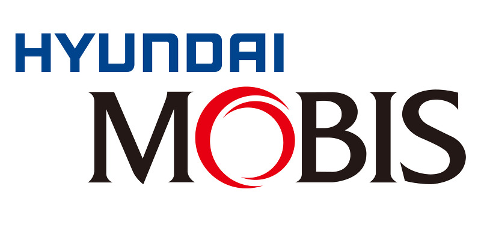

  
  

  
# 현대 모비스 청소년 공학리더
## 선덕고등학교 (2019~2021)의 코드 기록 모음

### 개요

 2018년 처음 대회에 출전한 학생들. 왼편이 선덕고등학교 학생들이다. 

현대 모비스는 2018년부터 서울 권역에 있는 자율형 사립고등학교 내 고등학생들로 이루어진 팀을 꾸려 자율주행자동차를 직접 만드는 [청소년 공학리더 대회를 개최](https://www.weeklytoday.com/news/articleView.html?idxno=65066)했다. 초기에는 주로 학습을 하는 팀으로 꾸려졌고, 이후에는 직접 작성한 알고리즘을 기반으로 정해진 트랙에서 자율주행자동차의 성능을 겨루는 대회 방식으로 그 성격이 바뀌었다.

선덕고등학교는 2018년부터 참여하였고, 나는 2019년 선덕고등학교 내 동아리 청년공학리더에 들어가 본격적으로 활동을 시작했다. 
